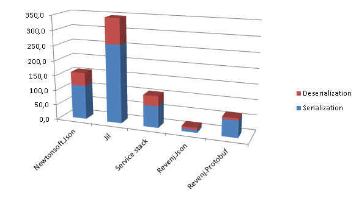
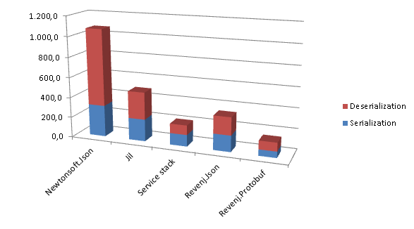
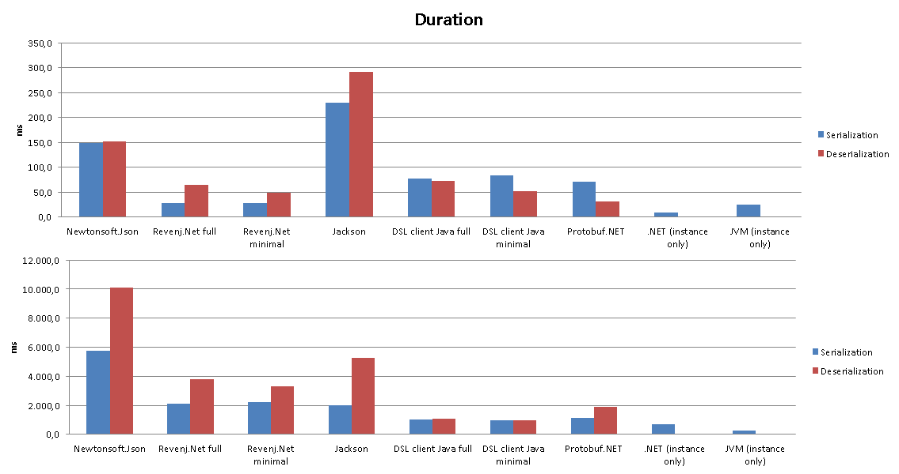
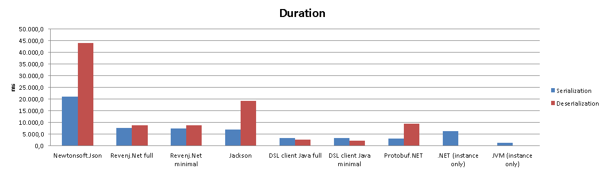
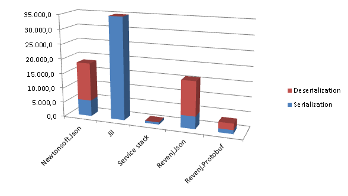
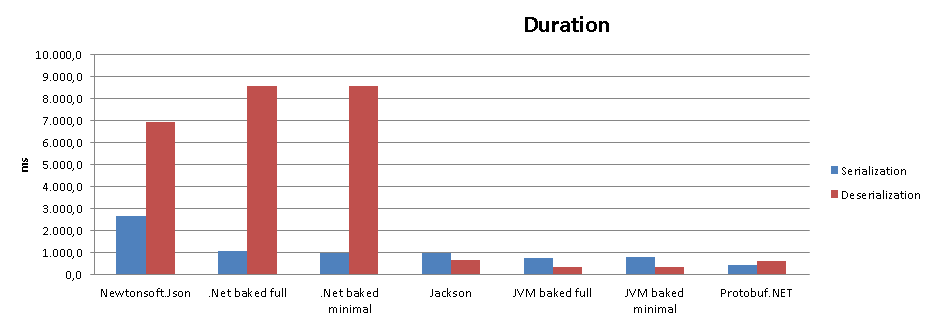
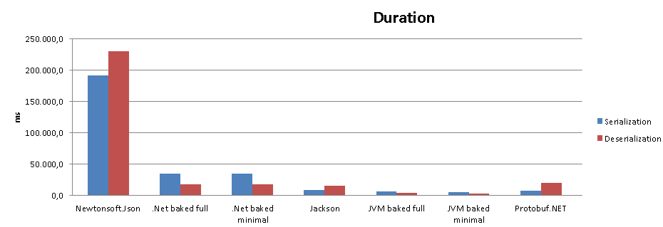

##.NET vs JVM Json serialization

This is reference benchmark for the fastest Json serialization libraries in .NET and JVM. It includes most popular libraries (Newtonsoft.Json and Jackson) to show difference between libraries for various scenarios.

Variety of models are tested, from small simple objects, to very complex large objects; with different number of loops.

More libraries are included in the benchmark, but not included in the result, since they are unable to correctly complete the tests.

To give more interesting results, we'll also run tests on Mono to see how it compares to JVM/.NET.

###Models

 * [small](Benchmark/SmallObjects.dsl)
 * [standard](Benchmark/StandardObjects.dsl)
 * [large](Benchmark/LargeObjects.dsl)
 
###Testing assumptions

 * .NET: from stream and to stream - we want to avoid LOH issues, so no byte[] examples (even if it could be used on small objects) - while we could use byte[] pool just for serialization, this bench doesn't currently test for that
 * JVM: from byte[] to byte[] - while .NET reuses same stream instance, JVM baked in serialization always create a new byte[] when converting String -> byte[] and Jackson uses it's own optimizations and specialized streams to handle such scenario
 * simple model - tests actual serialization infrastructure since there is little serialization to do
 * standard model - non-trivial document model, should represent real world scenarios
 * large model - big documents - tests should be bound by non-infrastructure parts, such as DateTime parsing, base64 conversion, etc...
 * almost default configuration - large model contains "advanced" features, such as interface serialization, which causes slightly modifications to Newtonsoft.Json configuration; still it uses default enum representation as number, which is one of the difference during serialization (no native Date type in .NET - although baked in serialization writes it in native date format)
 * one test at a time - perform one test and exit - while this will nullify JVM optimizations in runtime, they should show up in tests with larger number of loops.
 * Protocol buffers are here just to provide baseline
 * track duration of creating new object instance
 * other libraries are available for testing, but not included in results (since they fail on some or all tests)

###Libraries

 * Newtonsoft.Json 6.0.6 - most popular Nuget package
 * Revenj.Json (1.2.0) (baked in serialization code) - DSL Platform bakes in serialization directly into the C# classes. Revenj Json converters are used for serialization and deserialization 
 * Protobuf.NET (Revenj 1.2.0) - default Revenj Protobuf serialization which uses modified Protobuf-net library (various bugfixes and changes - to support dynamic serialization, nullable struct collections,...)
 * Jackson 2.4.3 - most popular JVM Json serializer
 * DSL client Java (1.2.0) - DSL Platform baked in serialization into Java classes. DSL client java converters are used for serialization and deserialization
 
###Startup times

It's known issue that serialization libraries suffer from startup time, since they need to build and cache parsers for types.
Let's see how much of an issue that is:

    Small 1 (Message)

As expected baked in serialization has minimal startup time, since it was amortized at compile time. While this can be nullified on servers with longer startup, it's not really a big issue but it can cause noticeable delays on mobile apps. Java seems to be doing exceptionally well on startup times. It's really overdue to stop using "Knock, knock, who's there joke" about it.

###Small model

Most libraries optimize for small Json payload, both with data structures and algorithms. These tests are usually infrastructure bound.

    Small 1.000.000 (Message)

Since there is large number of loops JVM optimization kicks-in so it's interesting to compare it to both smaller number of loops (100k) and larger number of loops (10M).

###Sparse instances

Some libraries by default exclude null and default values since they can be implied on the other end.

    Standard 10.000/1.000.000 (DeletePost)

While .NET it's somewhat faster before JVM optimization kicks-in, JVM seems to be 2x faster after. It's also interesting to see that omitting null values don't have noticeable impact on speed.

###Non-trivial model

Non-trivial model should reflect most CRUD scenarios with documents. This example uses only several data types but it shows very interesting difference between .NET and JVM.

    Standard 100.000 (Post)

Even on smaller number of runs, .NET is not faster anymore. This is partly due to heavy optimizations in the JVM library. Again, after HotSpot optimizations JVM seems to be several times faster. Same optimizations could not be used for baked in libraries due to different APIs on .NET Framework and Java (without a massive code increase).

###Large model

Large model contains several advanced features, such as interface serialization, occasional byte[] serialization and deep nested objects. Strange data types were left out of the test, since most libraries don't support it out of the box.

    Large 1.000 (Book)

Results seem to be consistent regardless of the number of loops. .NET takes much more time to construct object instances. Results are consistent with previous tests.

###Mono comparison

It's interesting to see how Mono handles itself in these tests.

    Small 1.000.000 (Complex)

    Small 10.000.000 (Post)

Mono is known to have few issues. First picture shows what to expect if we hit one of those. In best case, it's only couple of times slower than .NET. *This particular slowdown is caused by poor decimal implementation in Mono and long standing bug of trailing zeros on decimal.*

###Full results

Intel(R) Core(TM) i5-4440 CPU @ 3.10GHz / 32GB RAM

.NET 4.5.1, Mono 3.12, JVM 1.8.25

Results for [Windows](results/results-windows.xlsx).
Results for [Linux](results/results-linux.xlsx).

###Reproducing results

Run [GatherResults.exe](app/GatherResults.exe) or *GatherResults.exe . 5*

Individual tests can be run as:

 * .NET: [JsonBenchmark.exe](app/JsonBenchmark.exe) (example: *JsonBenchmark.exe BakedInMinimal Small Both 1000000*)
 * JVM: [json-benchmark.jar](app/json-benchmark.jar) (example: *java -jar json-benchmark.jar Jackson Standard Serialization 100000*) 

If you are interested in changing the models, then you can:

 * install Visual studio plugin: [DDD for DSL](https://visualstudiogallery.msdn.microsoft.com/5b8a140c-5c84-40fc-a551-b255ba7676f4)
 * or use [dsl-clc.jar with compile.bat](Benchmark/compile.bat)

If you want to test other libraries run benchmark without arguments to find out which libraries are available. For example to test Jil run: *JsonBenchmark.exe Jil Small Both 1000000* (most of them have issues - fail to serialize some fields, incorrectly deserializes date, throw exceptions due some bugs, etc... )

Invalid deserialization will be detected only if **Check** argument is used.

###Conclusions

* JVM seems to always be faster after optimization kicks-in.
* Newtonsoft.Json is comparable with Jackson on features and almost in speed (at least relative to baked in serialization which can be considered baseline).
* Baked in serialization is not a replacement for generic JSON libraries (think of it as schema based serialization, not attribute based one), but it's several times faster than other serialization libraries.
* One test focuses on sparse objects to show difference between excluding default parameters from JSON. It doesn't seem to be worth it - at least to differences gained in other ways.
* Non UTC DateTime can cause really slow serialization on .NET
* Mono has **slowspots** - really unoptimized parts of it.
