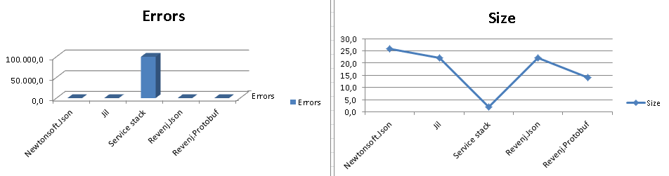
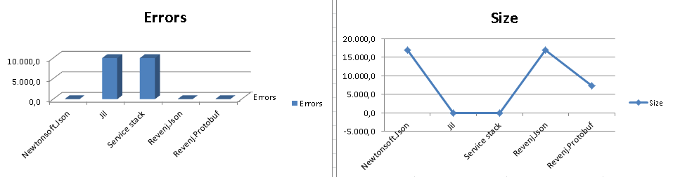
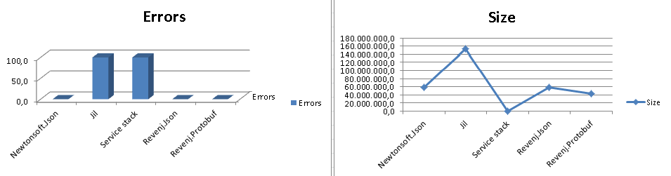

##How fast are .NET Json serializers?

In yet another benchmark, we will put up popular Newtonsoft.Json against Stackoverflow's Jil, Service Stack Text and DSL Platform baked in serialization.
We'll be testing variety of models, from small simple objects, to very complex large objects.

###Models

 * [small](Benchmark/SmallObjects.dsl)
 * [standard](Benchmark/StandardObjects.dsl)
 * [large](Benchmark/LargeObjects.dsl)
 
###Testing assumptions

 * from stream and to stream - we want to avoid LOH issues, so no string/byte[] examples
 * simple model - tests actual serialization infrastructure since there is little serialization to do
 * standard model - non-trivial document model
 * large model - big documents - tests are bound by non-infrastructure parts, such as DateTime parsing, base64 conversion, etc...
 * almost default parameters - large model contains "advanced" features, such as interface serialization, which causes slightly modifications to Newtonsoft.Json configuration
 * one test at a time - perform one test and exit
 * Protocol buffers are here just to provide baseline

###Libraries

 * Newtonsoft.Json 5.0.6 - most popular Nuget package. Very good library (only one bug detected and fixed) with excellent performance
 * Jil 2.1.1 - new kid on the block. Uses variety of optimizations during serialization
 * ServiceStack.Text 4.0.32.0 - claims to be fastest .NET Json serializer (but fails at most tests)
 * Revenj.Json (1.1.0) (baked in serialization code) - DSL Platform bakes in serialization directly into the model. Revenj Json converters are used for serialization and deserialization 
 * Revenj.Protobuf (1.1.0) - default Revenj Protobuf serialization which uses modified Protobuf-net library (various bugfixes and changes - to support dynamic serialization)
 
###Startup times

It's known issue that serialization libraries suffer from startup time, since they need to build and cache parsers for types.
Let's see how much of an issue is that:

    Small 1

As expected manual serialization has minimal startup time, since it was amortized at compile time. Since this cost can be nullified during system startup it's not really a big issue.

###Small model

Most libraries optimize for small Json payload, both with data structures and algorithms. These tests are usually infrastructure bound.

    Small 100.000

We can see Jil doing really well for small simple messages. Newtonsoft.Json struggles with deserialization in this test. ServiceStack.Text results would be impressive if they were correct.

###Non-trivial model

Non-trivial model should reflect most CRUD scenarios with documents. In this example it contains several data types, fields, collections, but nothing fancy (like polymorphism or strange data types).

    Standard 10.000

It seems Jil fails at serialization in this test. Newtonsoft again is lagging on deserialization.

###Large model

Sometimes big payload is exchanged over the wire. This example should be mostly .NET Framework bound, although it's interesting to see how each library copes with LOH issues. Also, simple polymorphism is utilized just to check if library supports such scenario. Strange data types were left out of the test, since most libraries don't support it out of the box.

    Large 100

In this test both Jil and ServiceStack.Text fails at deserialization. Newtonsoft is coping really well against the manual serialization, but at the cost of the unnecessary memory fragmentation.

###Full results

Results are available in [Excel file](results/results.xlsx).

###Reproducing results

It's non-trivial to reproduce this tests, since Revenj is not optimized for standalone testing. 

Easiest way to reproduce it is to:

 * download [setup](https://github.com/ngs-doo/json-benchmark/releases/download/1.0.0/setup.zip) and unpack it
 * apply *Migration.sql* script to a Postgres database
 * change ConnectionString key in [JsonBenchmark.exe.config](Benchmark/App.config) to point to the Postgres database
 * run *GatherResults.exe* or (*GatherResults.exe JsonBenchmark.exe 5*)

More complicated way to reproduce it is to:

 * install Visual studio plugin: [DDD for DSL](https://visualstudiogallery.msdn.microsoft.com/5b8a140c-5c84-40fc-a551-b255ba7676f4)
 * register at [DSL Platform](https://dsl-platform.com) to be able to compile DSL models
 * login to plugin and change [connection string](Benchmark/JsonBenchmark.sln)
 * download Revenj core (v1.1.0) from plugin configuration options
 * upgrade database and recreate [ServerModel.dll](Benchmark/lib/ServerModel.dll) from DSLs
 * run [GatherResults solution](GatherResults/GatherResults.sln) to run the analysis

###Conclusions

* Jil and ServiceStack.Text, while performance oriented are not nearly mature as Newtonsoft.Json. ServiceStack also produces "invalid" json to gain some performance.
* Newtonsoft.Json is stable and performant, but it can be as 3x slower than DSL baked in serialization.