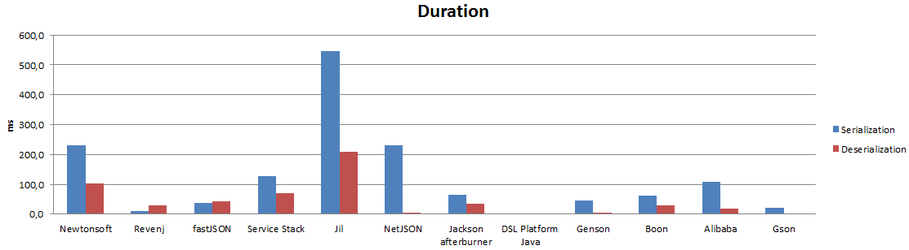
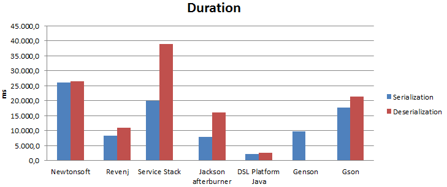
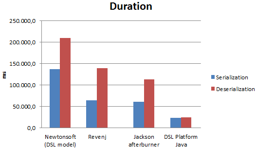
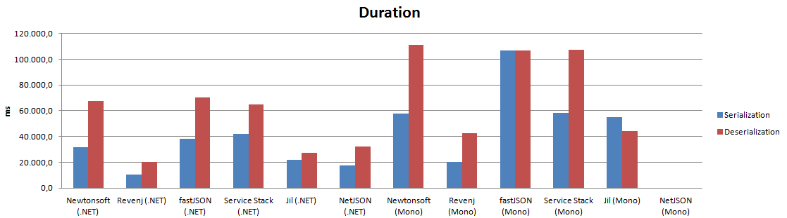

##.NET vs JVM JSON serialization

This is reference benchmark for the fastest JSON serialization libraries in .NET and JVM. It includes various other libraries to show difference between them for various scenarios.

Varieties of models are tested, from small simple objects, to very complex large objects; with different number of loops.

Many libraries are unable to fully complete the benchmark, due to various reasons.

To give more interesting results, we'll also run tests on Mono to see how it compares to JVM/.NET.

###Models

 * Small: [DSL](Benchmark/SmallObjects.dsl) or [POCO](Benchmark/Models.Small.cs)
 * Standard: [DSL](Benchmark/StandardObjects.dsl) or [POCO](Benchmark/Models.Standard.cs)
 * Large: [DSL](Benchmark/LargeObjects.dsl) or [POCO](Benchmark/Models.Large.cs)
 
###Testing assumptions

 * .NET: from stream and to stream - we want to avoid LOH issues, so no byte[] examples (even if it could be used on small objects) - while we could use byte[] pool just for serialization, this bench doesn't currently test for that
 * JVM: from byte[] to byte[] - while .NET reuses same stream instance, JVM libraries are allowed to reuse byte[]. Most of them don't support such reuse 
 * simple model - tests actual serialization infrastructure since there is little serialization to do
 * standard model - non-trivial document model, should represent real world scenarios
 * large model - big documents - tests should be bound by non-infrastructure parts and stress underlying platform
 * almost default configuration - large model contains "advanced" features, such as interface serialization. JVM libraries require extension for Joda Time. Some libraries don't support extensions ;(
 * one test at a time - perform one test and exit - while this will nullify JVM optimizations in runtime, they should show up in tests with larger number of loops.
 * track duration of creating new object instance
 * some other libraries are available for testing, but not included in results (Protobuf.NET, Microsoft Bond, ...)
 * JMH is not used - but dead code elimination is not really an issue (one can always use Check argument to be 100% sure there is no dead code elimination).

###Libraries

 * **Newtonsoft.Json 6.0.8** - "Popular high-performance JSON framework for .NET"
 * **Revenj.Json 1.2.0** - Part of Revenj framework. POCO + serialization/deserialization methods 
 * **Service Stack 4.0.40** - ".NET's fastest JSON Serializer"
 * **fastJSON 2.1.14** - "smallest, fastest polymorphic JSON serializer"
 * **Jil 2.10.0** - "A fast JSON serializer and deserializer"
 * **NetJSON 1.0.7** - "Faster than Any Binary?"
 * **Jackson 2.5.4** - "aims to be the best possible combination of fast, correct, lightweight, and ergonomic for developers"
 * **DSL client Java 1.3.0** - Part of DSL Platform Java library. POJO + serialization/deserialization methods
 * **Boon 0.33** - "Boon is the probably the fastest way to serialize and parse JSON in Java so far for your project"
 * **Alibaba/fastjson 1.2.6** - "measured to be faster than any other Java parser and databinder, includes jackson"
 * **Gson 2.3.1** - "Gson is a Java library that can be used to convert Java Objects into their JSON representation"
 * **Genson 1.3** - "Java and Scala to JSON conversion library"

 
###Startup times

It's known issue that serialization libraries suffer from startup time, since they need to build and cache parsers for types.
Let's see how much of an issue that is:

    Small 1 (Message)

As expected baked in serialization code has minimal startup time, since it was amortized at compile time. While this can be nullified on servers with longer startup, it can cause noticeable delays on mobile apps. Java seems to be doing exceptionally well on startup times. It's really overdue to stop using "Knock, knock, who's there joke" about it.

###Small model

Most libraries optimize for small JSON payload, both with data structures and algorithms. These tests are usually infrastructure bound.

    Small 1.000.000 (Message)

Since there is large number of loops JVM optimization kicks-in so it's interesting to compare it to both smaller number of loops (100k) and larger number of loops (10M).

###Non-trivial model

Non-trivial model should reflect most CRUD scenarios with documents. This example uses only several data types but it shows very interesting difference between .NET and JVM.

    Standard 100.000 (Post)

Even on smaller number of runs, .NET is not faster anymore. LOH issue in .NET prohibits advanced optimizations available on JVM. Some libraries stop working on non-trivial stuff. 

###Large model

Large model contains several advanced features, such as interface serialization, occasional byte[] serialization and deep nested objects. Large strings and other objects are used which cause 10x slower instance creation in .NET.

    Large 1.000 (Book)

Results seem to be consistent regardless of the number of loops. Revenj manages to match Jackson speed. Newtonsoft works much slower if vanilla POCO classes are used. Most libraries are unable to complete this bench.

###Mono comparison

Mono has improved significantly with v4. 

    Small 10.000.000 (Post)

It's only twice as slow as .NET version.

###Full results

Intel(R) Core(TM) i5-4440 CPU @ 3.10GHz / 32GB RAM

.NET 4.5.1, Mono 4.0.1, JVM 1.7.76/1.8.31

Results for [Windows](results/results-windows.xlsx).
Results for [Linux](results/results-linux.xlsx).
.NET vs Mono [comparison](results/result-comparison.xlsx).

###Reproducing results

Run [GatherResults.exe](app/GatherResults.exe) or *GatherResults.exe . 5*

Individual tests can be run as:

 * .NET: [JsonBenchmark.exe](app/JsonBenchmark.exe) (example: *JsonBenchmark.exe RevenjJsonMinimal Small Both 1000000*)
 * JVM: [json-benchmark.jar](app/json-benchmark.jar) (example: *java -jar json-benchmark.jar Jackson Standard Serialization 100000*) 

If you are interested in changing the models, then you can:

 * install Visual studio plugin: [DDD for DSL](https://visualstudiogallery.msdn.microsoft.com/5b8a140c-5c84-40fc-a551-b255ba7676f4)
 * or use [dsl-clc.jar with compile.bat](Benchmark/compile.bat)

If you want to test other libraries run benchmark without arguments to find out which libraries are available. For example to test Microsoft Bond run: *JsonBenchmark.exe BondBinary Small Both 1000000*.

To check if library is working correctly, use **Check** argument. Some libraries are reported to work incorrectly but still included in results (Service Stack serializes only 3 digits on DateTime, which causes incorrect comparison after deserialization, ...)

###Conclusions

* JVM seems to always be faster after optimization kicks-in
* LOH design issue prevents .NET to match JVM in speed
* Newtonsoft.Json is comparable with Jackson on features/quality
* Most libraries are toys and people have religious attachment to them
* Almost everyone claims to be THE FASTEST 
* Non UTC DateTime can cause really slow serialization on .NET
